## Part 1. Готовый докер

Скачаем докер, но для этого потребуется зарагестрироваться на сайте https://hub.docker.com
		
		вводим команду sudo docker login используя ВПН (тк без него не скачивается) 
НО ничего не работало и не скачивалось, поэтому качаем с левого сайта) этой командой 

	sudo docker pull dockerhub.timeweb.cloud/library/docker:latest

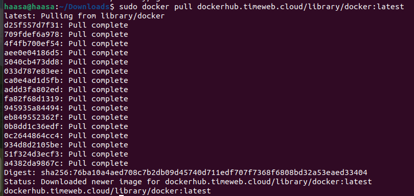

Взять докер-образ с **nginx** и выкачать его при помощи `docker pull`.

	sudo docker pull dockerhub.timeweb.cloud/library/nginx:latest

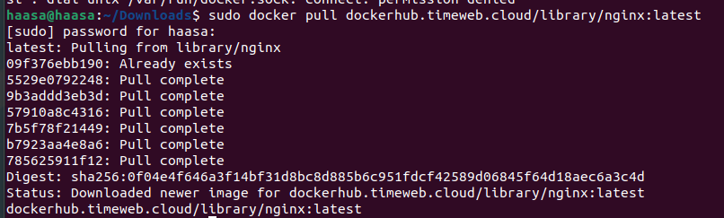

Проверить наличие докер-образа через 

	sudo docker images.

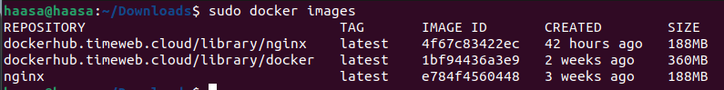

Запустить докер-образ через `docker run -d [image_id|repository]`.

	sudo docker run -d 4f67c83422ec

	-d: это флаг, который указывает Docker на запуск контейнера в фоновом режиме (detached mode). Это означает, что контейнер будет работать в фоновом режиме, и командная строка будет освобождена для дальнейшего использования.

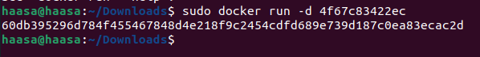

Проверить, что образ запустился через `docker ps`

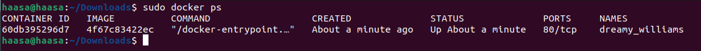

Посмотри информацию о контейнере через `docker inspect [container_id|container_name]`.

	sudo docker inspect 60db395296d7

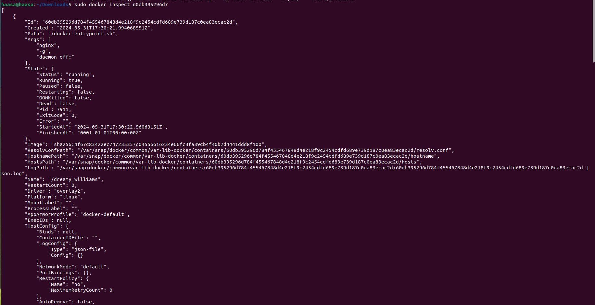

Остановить докер образ через `docker stop [container_id|container_name]`.

	sudo docker stop  60db395296d7

и проверить, что образ остановился через `docker ps`.

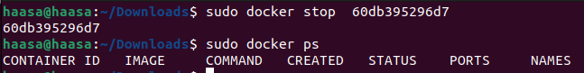

Запустить докер с портами 80 и 443 в контейнере, замапленными на такие же порты на локальной машине, через команду *run*.

По выводу команды определить размер контейнера, список замапленных портов и ip контейнера.

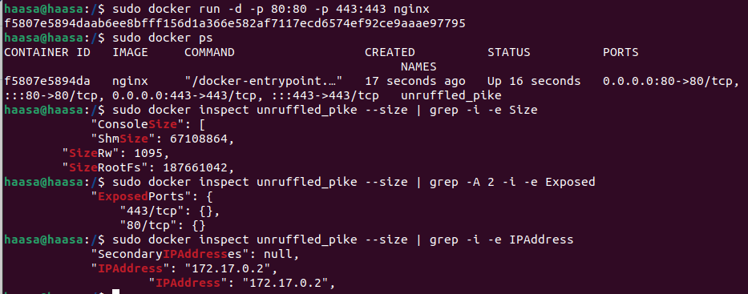

Где первые 80 и 443 - это локальные порты, а вторые 80 и 443 - порты контейнера.

	размер контейнера:
	sudo docker inspect unruffled_pike --size | grep -i -e Size

	замапленные порты:
	sudo docker inspect unruffled_pike --size | grep -A 2 -i -e Exposed

	IP контейнера
	sudo docker inspect unruffled_pike --size | grep -i -e IPAddress

Проверить, что в браузере по адресу *localhost:80* доступна стартовая страница **nginx**.

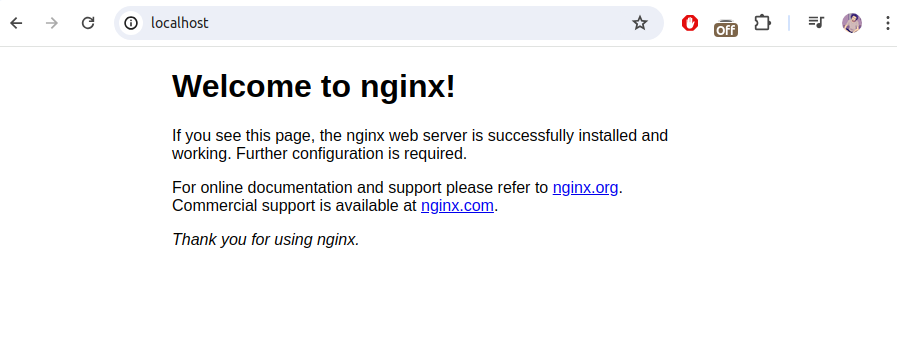

Перезапусти докер контейнер через `docker restart [container_id|container_name]`.

Проверить, что контейнер запустился.

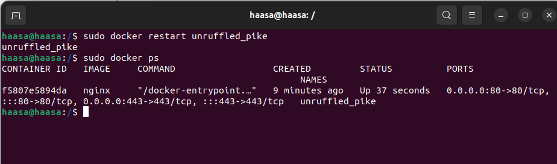

## Part 2. Операции с контейнером

Прочитать конфигурационный файл nginx.conf внутри докер контейнера через команду exec.

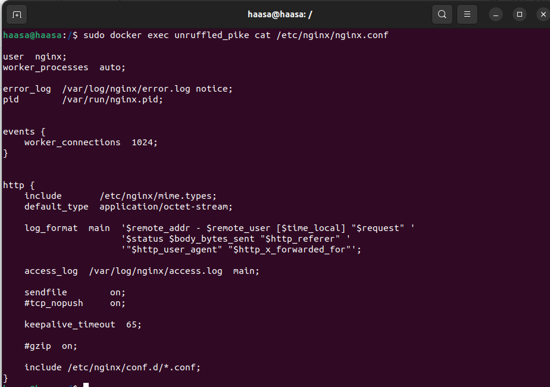

Создать на локальной машине файл nginx.conf. Настроить в нем по пути /status отдачу страницы статуса сервера nginx.

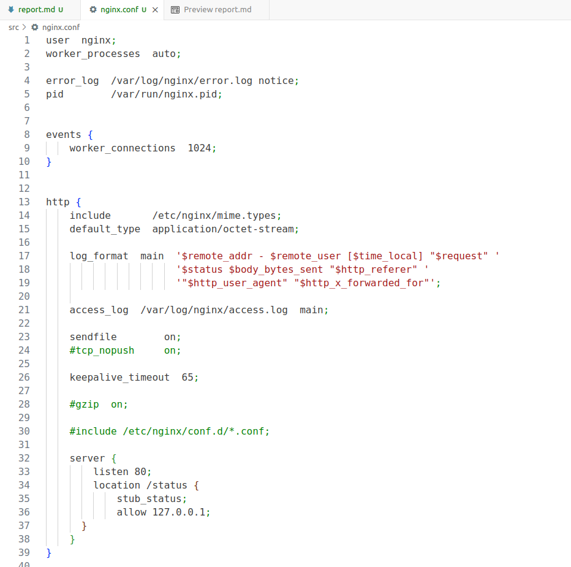

Скопировать созданный файл nginx.conf внутрь докер-образа через команду docker cp.

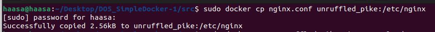

Перезапустить nginx внутри докер-образа через команду exec.

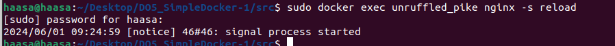

Проверить, что по адресу localhost:80/status отдается страничка со статусом сервера nginx.

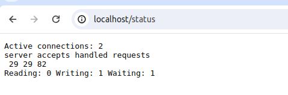

Экспортировать контейнер в файл container.tar через команду export Остановить контейнер.

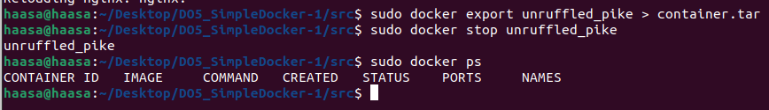

Удалить образ через docker rmi [image_id|repository], не удаляя перед этим контейнеры.

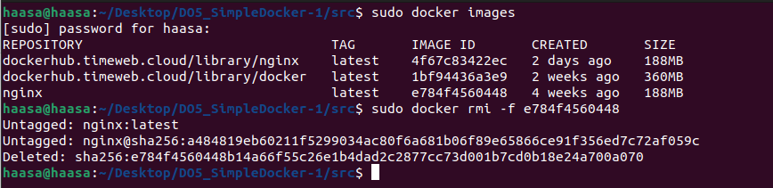

Удали остановленный контейнер.

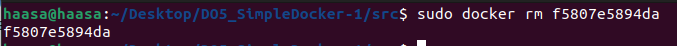

Импортировать контейнер обратно через команду import. Запустить импортированный контейнер.

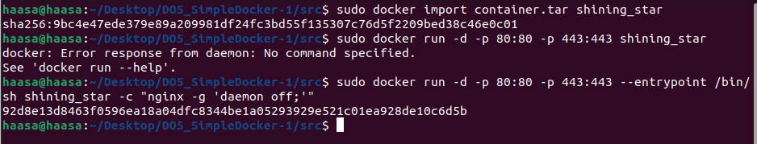

Проверить, что по адресу localhost:80/status отдается страничка со статусом сервера nginx.

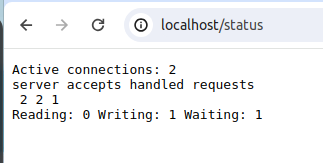

## Part 3. Мини веб-сервер

Написать мини-сервер на C и FastCgi, который будет возвращать простейшую страничку с надписью Hello World!.

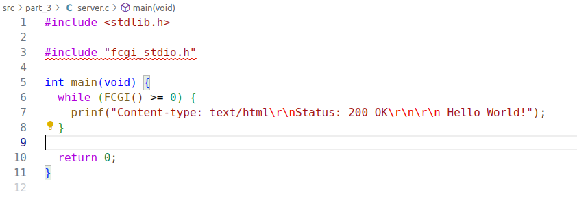

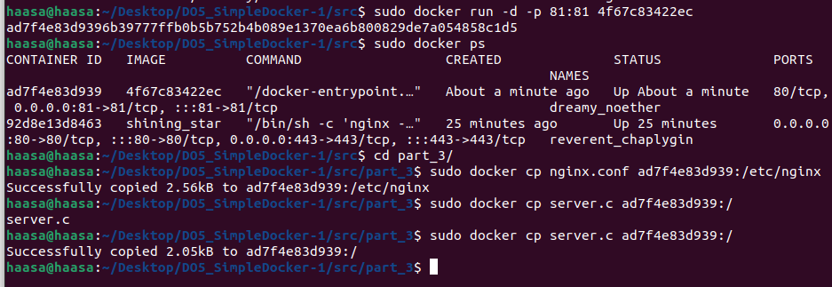

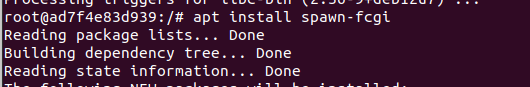

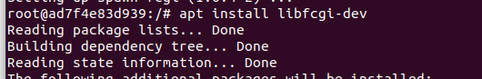

Запустить написанный мини-сервер через spawn-fcgi на порту 8080.

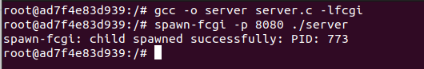

Написать свой nginx.conf, который будет проксировать все запросы с 81 порта на 127.0.0.1:8080.

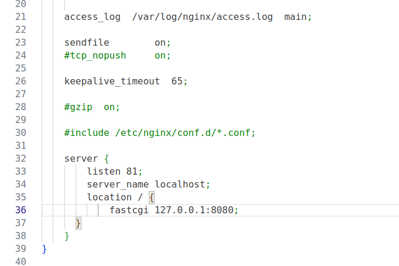

Проверить, что в браузере по localhost:81 отдается написанная тобой страничка.

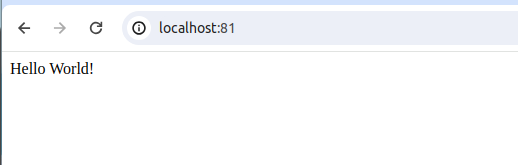

Положить файл nginx.conf по пути ./nginx/nginx.conf 

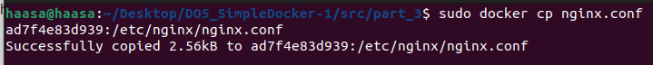

## Part 4. Свой докер
Собрать написанный докер-образ через docker build при этом указав имя и тег.

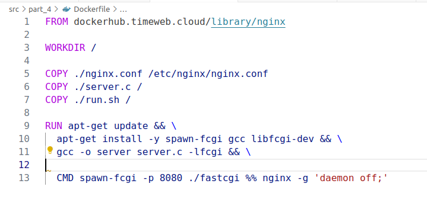

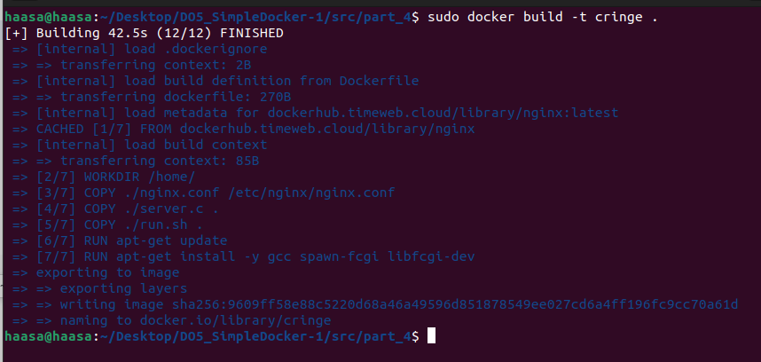

Проверить через docker images, что все собралось корректно.

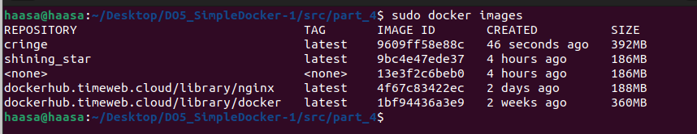

Запустить собранный докер-образ с маппингом 81 порта на 80 на локальной машине 

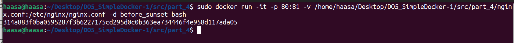

Проверить, что по localhost:80 доступна страничка написанного мини сервера.

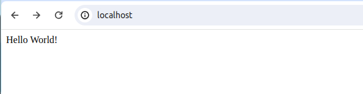

Дописать в ./nginx/nginx.conf проксирование странички /status, по которой надо отдавать статус сервера nginx.

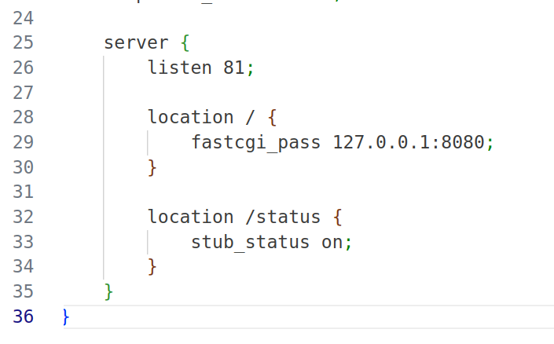

Перезапустить докер-образ.

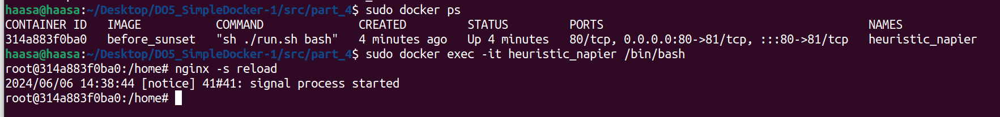

После сохранения файла и перезапуска контейнера, конфигурационный файл внутри докер-образа должен обновиться самостоятельно

Проверить, что теперь по localhost:80/status отдается страничка со статусом nginx

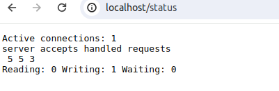

## Part 5. Dockle

!!Примечание!!

	Перед выполнением данного шага необходимо установить утилиту [dockle]
	инструкция по установке [https://github.com/goodwithtech/dockle]

Просканировать образ из предыдущего задания через dockle [image_id|repository].

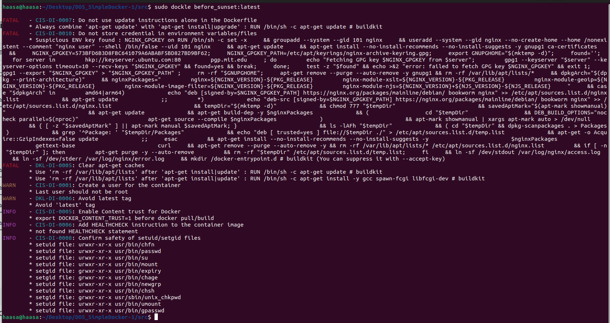

Так, чтобы при проверке через dockle не было ошибок и предупреждений.

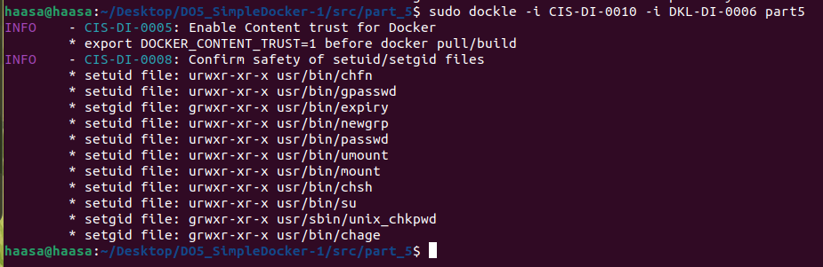

## Part 6. Базовый Docker Compose

Написать файл docker-compose.yml, с помощью которого:

1) Поднять докер-контейнер из Части 5 (он должен работать в локальной сети, т.е. не нужно использовать инструкцию EXPOSE и мапить порты на локальную машину).

2) Поднять докер-контейнер с nginx, который будет проксировать все запросы с 8080 порта на 81 порт первого контейнера.

Замапить 8080 порт второго контейнера на 80 порт локальной машины.

Остановить все запущенные контейнеры.

Собрать и запустить проект с помощью команд docker-compose build и docker-compose up.

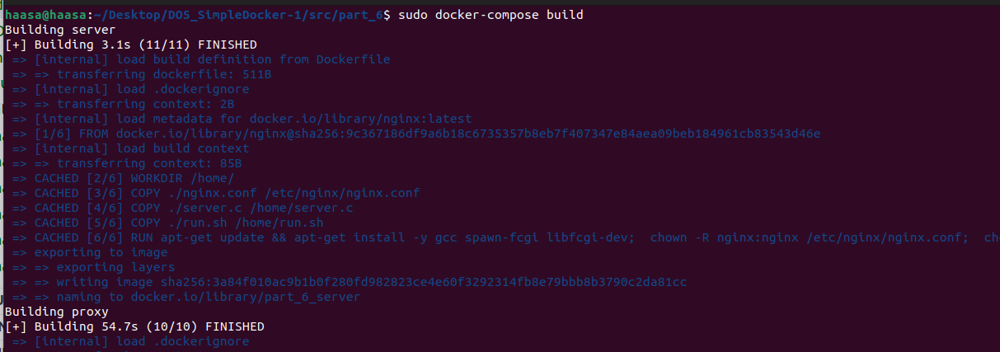

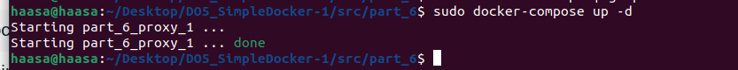

Проверить, что в браузере по localhost:80 отдается написанная тобой страничка, как и ранее.

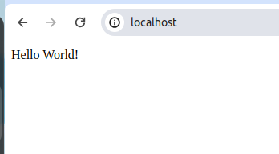
